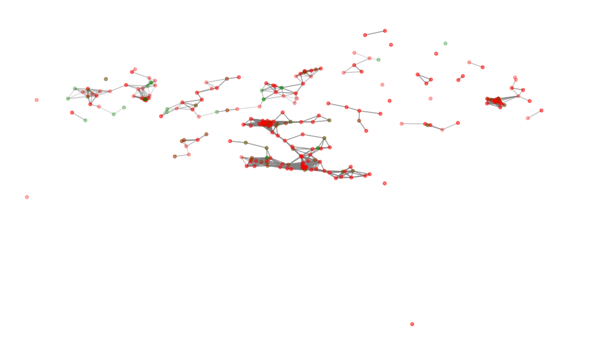

# GCN-based Handover Prediction System

An automated handover recommendation system leveraging **Graph Convolutional Networks (GCN)** to optimize BTS (Base Transceiver Station) selection, enhancing seamless mobility and minimizing call drops in heterogeneous radio access networks.

## Features
- **Geo-spatial Adjacency Modeling**: BTS topology is modeled using Haversine distance-based adjacency matrices.
- **Multi-feature Encoding**: Processes BTS operational parameters (Site Category, Tower Type, Status) for context-aware prediction.
- **GCN Architecture**: Utilizes `torch_geometric` to aggregate neighbor information for robust handover target selection.
- **Realistic Performance**: Achieves ~83-85% accuracy in simulated real-world environments with environmental noise.
- **Topology Visualization**: Integrated NetworkX visualization to inspect the BTS network and potential handover links.




## Project Structure
- `handover_gcn.ipynb`: The main Jupyter Notebook containing the end-to-end pipeline (Preprocessing -> Modeling -> Training -> Visualization).
- `train_handover.py`: A standalone Python script for quick validation and performance analysis.
- `.gitignore`: Configured to protect sensitive data files (Excel datasets).

## Installation & Usage
1. Clone the repository.
2. Install dependencies:
   ```bash
   pip install torch torch-geometric pandas numpy scikit-learn networkx matplotlib openpyxl
   ```
3. Open `handover_gcn.ipynb` in Jupyter Notebook or Google Colab and run the cells.
4. Ensure your BTS dataset is named `Proj_ Dataset.xlsx` in the same directory (Note: This file is ignored by Git for security).

## Technical Implementation
The system uses a two-layer GCN to learn node representations by aggregating features from spatially adjacent BTS. This allows the model to recommend the best target BTS even in complex, noisy network conditions.
